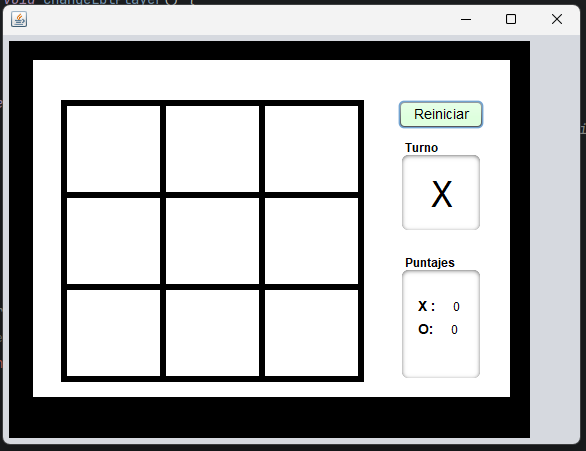
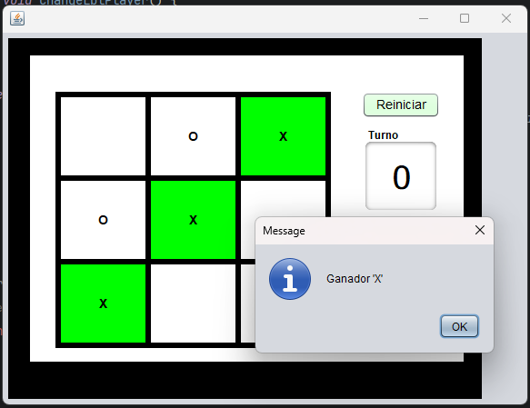
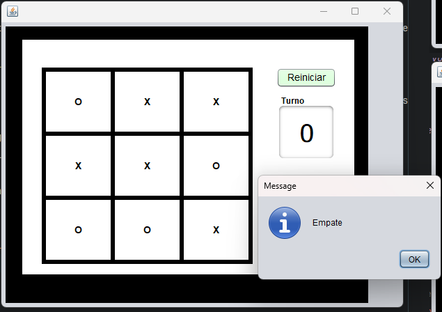

# Parte Práctica Parcial 2 - Juego de Totito

Este repositorio contiene el código fuente y la documentación de la Parte Práctica del Parcial 2 de un juego de "Totito". El juego ha sido implementado en Java y se centra en una aplicación de interfaz gráfica que permite a dos jugadores competir en una partida de Totito.

## Descripción del Proyecto

El juego de Totito es un clásico juego de mesa en el que dos jugadores compiten por ser el primero en alinear tres de sus símbolos (generalmente "X" o "O") en una fila, columna o diagonal. El objetivo de este proyecto es implementar una versión interactiva de este juego con las siguientes características:

- Interfaz gráfica intuitiva.
- Alternancia de turnos entre los jugadores.
- Detección de ganadores y empates.
- Puntuación para el seguimiento de los resultados de múltiples partidas.

## Capturas de Pantalla

